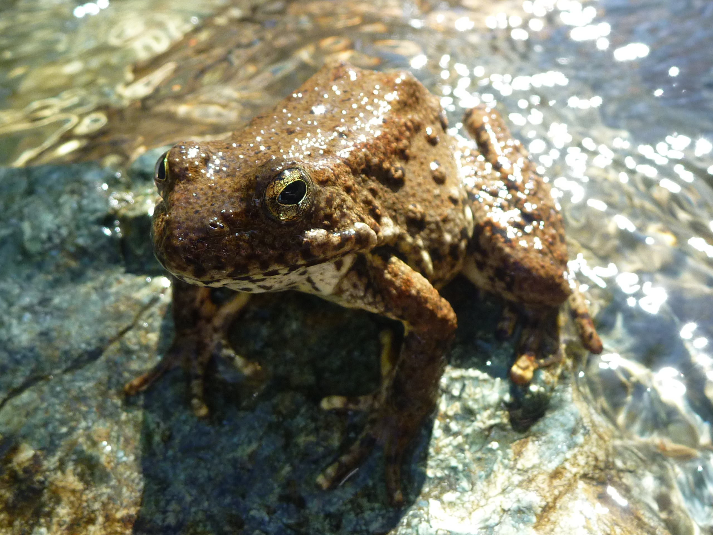
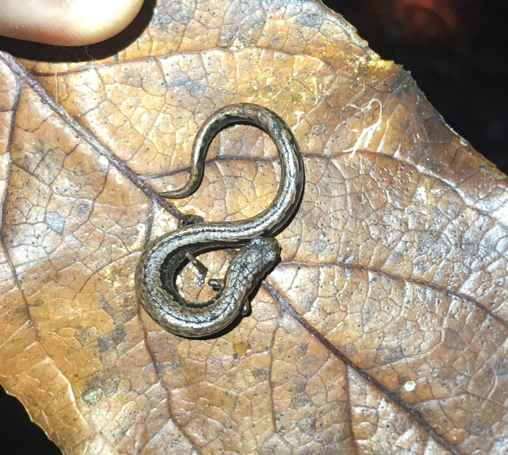

```{r setup, include=FALSE}
knitr::opts_chunk$set(echo = FALSE)
library(here)
```

The California/Nevada Amphibian Populations Task Force (APTF) provides a collaborative forum to understand and reverse amphibian population declines and to conserve all amphibians in California and Nevada and adjacent areas. 

We do this by facilitating communication among individuals who conduct scientific investigations, manage natural resources, or influence conservation policy. 

<aside>

**_Rana boylii_ (Placer County, R. Peek)**

```{r}

```

</aside>

The APTF holds an annual meeting to provide participants an opportunity to share new information and to discuss issues of concern. Information and ideas are also distributed via an electronic mailing list. Participation in the group is effected by joining the mailing list and attending the annual meetings. The group is chaired by Dr. David Bradford.

**_Batrachoseps_ (Humboldt County)**

```{r}

```

